# InternLM2-Tutorial-Assignment-Lecture 4
# Lecture 4
# 第4课 LMDeploy 量化部署 LLM&VLM实战    
 2024.4.9 安泓郡  
 [LMDeploy](https://github.com/InternLM/LMDeploy)    
 [第4课 视频](https://www.bilibili.com/video/BV1tr421x75B/)    
 [第4课 文档](https://github.com/InternLM/Tutorial/blob/camp2/lmdeploy/README.md)    
 [第4课 作业](https://github.com/InternLM/Tutorial/blob/camp2/lmdeploy/homework.md)    

 ## 第4课 笔记   

### 模型部署     

- 定义：模型部署就是将训练好的深度学习模型在特定环境中运行的过程。
- 场景：
  - 服务器端：CPU部署 单GPU/TPU/NPU部署， 多卡/集卡部署
  - 移动端/边缘端：移动机器人，手机...
- 挑战：
  - 计算量巨大
  - 内存开销巨大 20B模型 40G显存
  - 访存瓶颈 大模型推理“访存密集”型任务   
  - 动态请求  请求量 时间不确定   

### 模型部署方法    

- 模型剪枝(Pruning)
- 知识蒸馏(Knowledge Distillation, KD)
- 量化(Quantization)
  
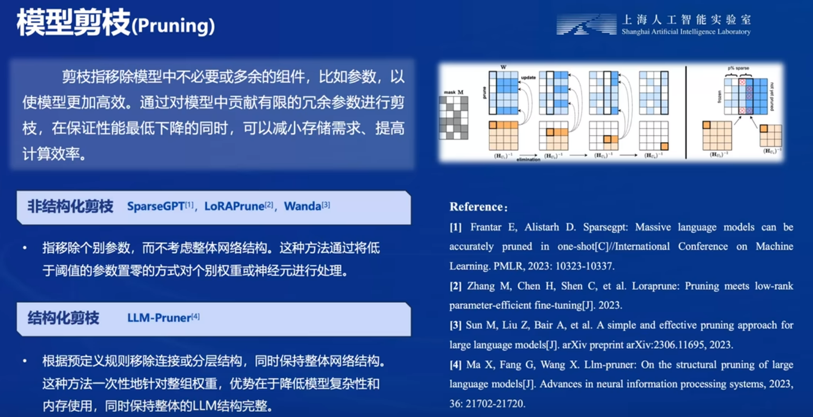
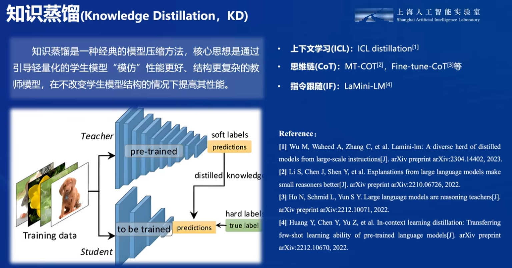
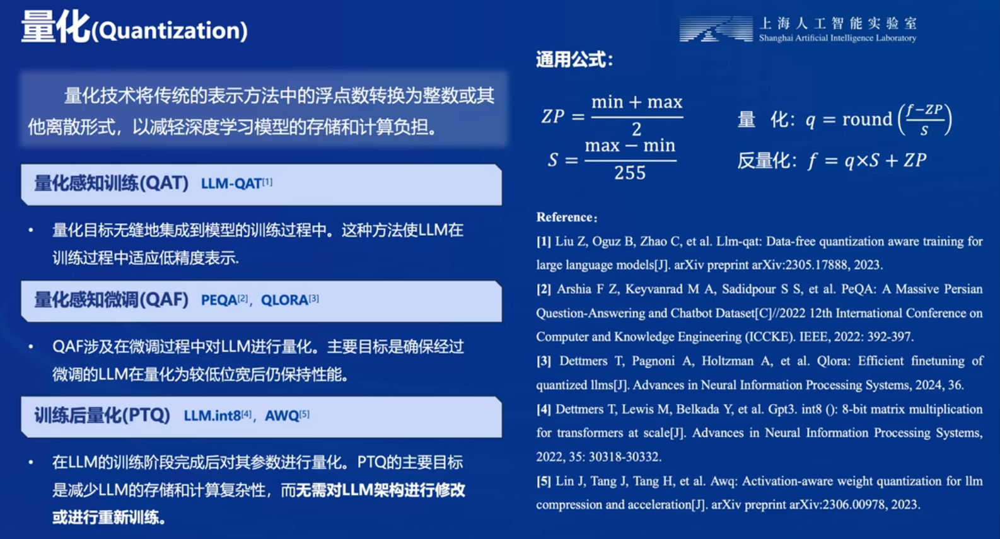

### **LMDeploy**   

- LMDeploy涵盖了LLM任务的全套轻量化、部署和服务解决方案；
- 核心功能：
    - 模型高效推理
    - 模型量化压缩
    - 服务化部署
- 性能提升
- 支持多模态
- LMDeploy支持多模型部署
  
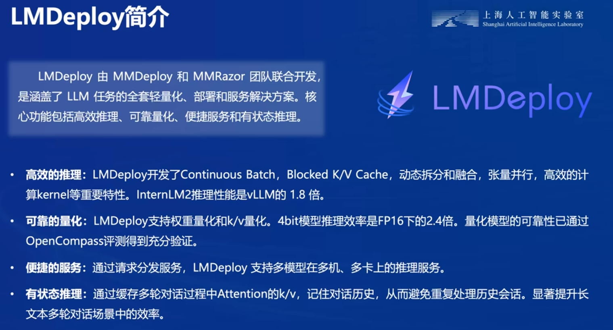
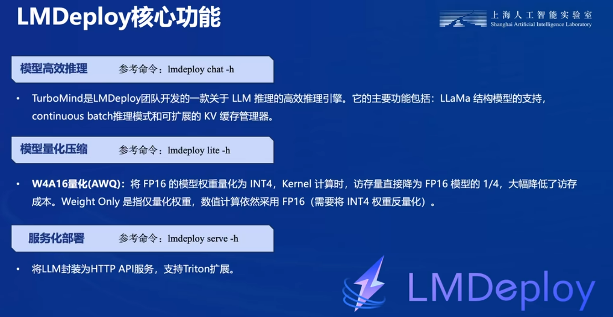
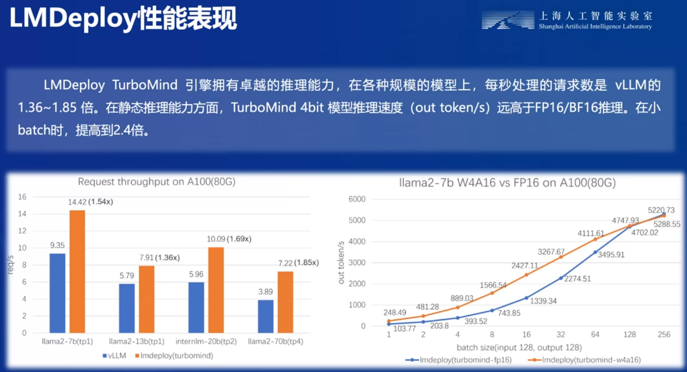   
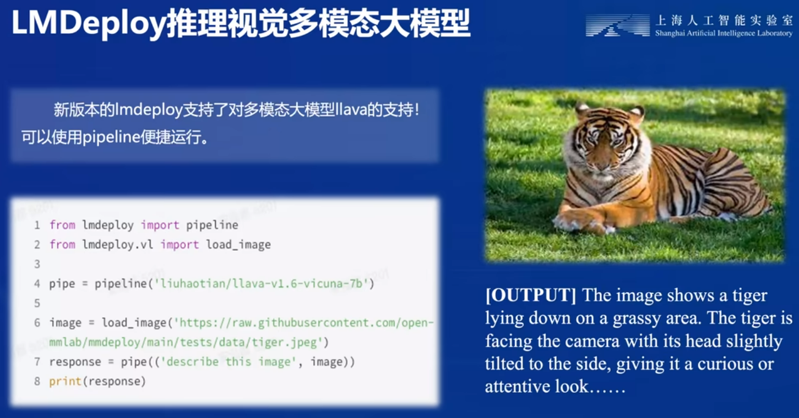
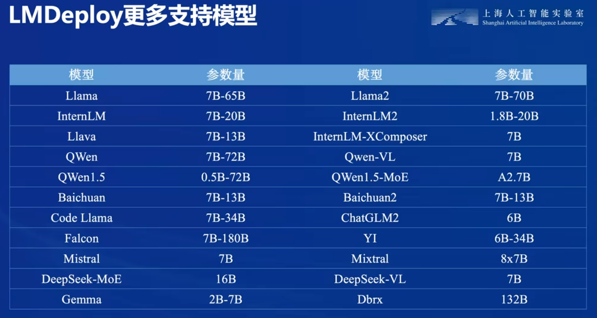


### 动手实践 - 安装、部署、量化     

#### 1.LMDeploy环境部署     

1.1 创建开发机
选择镜像`Cuda12.2-conda`；选择`10% A100*1GPU`；点击“立即创建”。   

1.2 创建conda环境
InternStudio上提供了快速创建conda环境的方法。打开命令行终端，创建一个名为`lmdeploy`的环境：   
```
studio-conda -t lmdeploy -o pytorch-2.1.2
```   

1.3 安装LMDeploy   
激活刚刚创建的虚拟环境:   
```
conda activate lmdeploy
```   

安装0.3.0版本的lmdeploy:   
```
pip install lmdeploy[all]==0.3.0
```   

#### 2.LMDeploy模型对话(chat)    

2.1 Huggingface与TurboMind   

**HuggingFace**  

[HuggingFace](https://huggingface.co/)是一个高速发展的社区，包括Meta、Google、Microsoft、Amazon在内的超过5000家组织机构在为HuggingFace开源社区贡献代码、数据集和模型。可以认为是一个针对深度学习模型和数据集的在线托管社区，如果你有数据集或者模型想对外分享，网盘又不太方便，就不妨托管在HuggingFace。

托管在HuggingFace社区的模型通常采用HuggingFace格式存储，简写为**HF格式**。

但是HuggingFace社区的服务器在国外，国内访问不太方便。国内可以使用阿里巴巴的[MindScope](https://www.modelscope.cn/home)社区，或者上海AI Lab搭建的[OpenXLab](https://openxlab.org.cn/home)社区，上面托管的模型也通常采用**HF格式**。

**TurboMind**    

TurboMind是LMDeploy团队开发的一款关于LLM推理的高效推理引擎，它的主要功能包括：LLaMa 结构模型的支持，continuous batch 推理模式和可扩展的 KV 缓存管理器。

TurboMind推理引擎仅支持推理TurboMind格式的模型。因此，TurboMind在推理HF格式的模型时，会首先自动将HF格式模型转换为TurboMind格式的模型。**该过程在新版本的LMDeploy中是自动进行的，无需用户操作。**

几个容易迷惑的点：
* TurboMind与LMDeploy的关系：LMDeploy是涵盖了LLM 任务全套轻量化、部署和服务解决方案的集成功能包，TurboMind是LMDeploy的一个推理引擎，是一个子模块。LMDeploy也可以使用pytorch作为推理引擎。
* TurboMind与TurboMind模型的关系：TurboMind是推理引擎的名字，TurboMind模型是一种模型存储格式，TurboMind引擎只能推理TurboMind格式的模型。

2.2 下载模型 

在开发机的共享目录中准备好了常用的预训练模型，可以运行如下命令查看： 

```sh
ls /root/share/new_models/Shanghai_AI_Laboratory/
```
显示如下，每一个文件夹都对应一个预训练模型。   
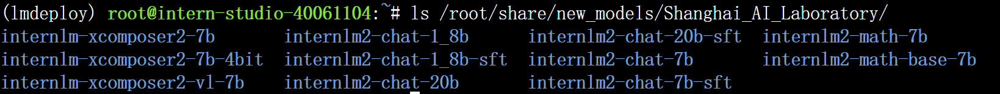   

以InternLM2-Chat-1.8B模型为例，从官方仓库下载模型。   
**InternStudio开发机上下载模型（推荐）**   

如果你是在InternStudio开发机上，可以按照如下步骤快速下载模型。

首先进入一个你想要存放模型的目录，本教程统一放置在Home目录。执行如下指令：

```sh
cd ~
```

然后执行如下指令由开发机的共享目录**软链接**或**拷贝**模型： 

```sh
ln -s /root/share/new_models/Shanghai_AI_Laboratory/internlm2-chat-1_8b /root/
# cp -r /root/share/new_models/Shanghai_AI_Laboratory/internlm2-chat-1_8b /root/
```

执行完如上指令后，可以运行“ls”命令。可以看到，当前目录下已经多了一个`internlm2-chat-1_8b`文件夹，即下载好的预训练模型。

```sh
ls
```

2.3 使用Transformer库运行模型   

Transformer库是Huggingface社区推出的用于运行HF模型的官方库。   

在2.2中，我们已经下载好了InternLM2-Chat-1.8B的HF模型。下面我们先用Transformer来直接运行InternLM2-Chat-1.8B模型，后面对比一下LMDeploy的使用感受。   

打开VSCode   

在终端中输入如下指令，新建`pipeline_transformer.py`。   
```
touch /root/pipeline_transformer.py
```

回车执行指令，可以看到侧边栏多出了pipeline_transformer.py文件，点击打开。后文中如果要创建其他新文件，也是采取类似的操作。   

内容复制粘贴进入`pipeline_transformer.py`  按`Ctrl+S`键保存   

回到终端，激活conda环境。   
```
python /root/pipeline_transformer.py
```
得到输出：   
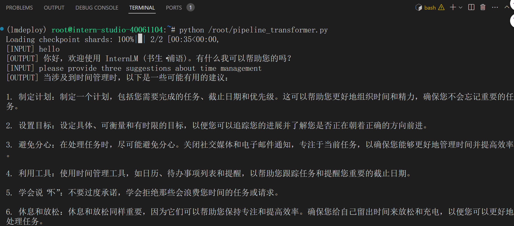   
**感受`Transformer`推理速度很慢，二轮对话完成用时约80秒**   

2.4 使用LMDeploy与模型对话   

如何应用LMDeploy直接与模型进行对话。

首先激活创建好的conda环境：
```
conda activate lmdeploy
```

使用LMDeploy与模型进行对话的通用命令格式为：   
```
lmdeploy chat [HF格式模型路径/TurboMind格式模型路径]
```

例如，您可以执行如下命令运行下载的1.8B模型：   
```
lmdeploy chat /root/internlm2-chat-1_8b
```
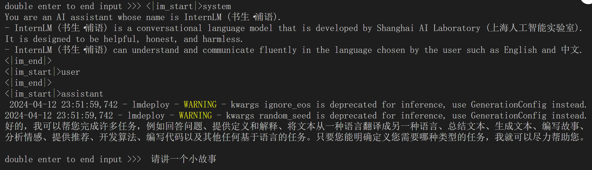     

可以与InternLM2-Chat-1.8B大模型对话了。比如输入“请给我讲一个小故事吧”，然后按两下回车键。   
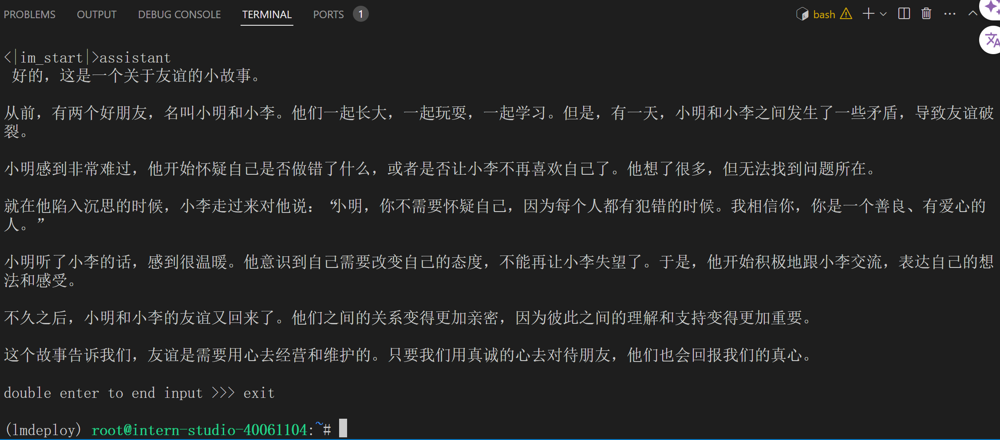  
**速度明显比原生Transformer快**

#### 3.LMDeploy模型量化(lite)   

主要介绍如何对模型进行量化。主要包括 KV8量化和W4A16量化。   

介绍 LMDeploy 量化方案前，需要先了解两个概念：

- 计算密集（compute-bound）: 指推理过程中，绝大部分时间消耗在数值计算上；针对计算密集型场景，可以通过使用更快的硬件计算单元来提升计算速。
- 访存密集（memory-bound）: 指推理过程中，绝大部分时间消耗在数据读取上；针对访存密集型场景，一般通过减少访存次数、提高计算访存比或降低访存量来优化。


 
  


 
 ## 第4课 作业     

### 基础作业（结营必做）
完成以下任务，并将实现过程记录截图：    

- 配置lmdeploy运行环境
  
  Dennis作业，详见笔记1.LMDeploy环境部署：
  - 创建开发机：选择镜像`Cuda12.2-conda` 选择`10% A100*1GPU`
  - 创建`conda`环境： `studio-conda -t lmdeploy -o pytorch-2.1.2`
  - 激活刚创建的虚拟环境： `conda activate lmdeploy`
  - 安装0.3.0版本的lmdeploy：`pip install lmdeploy[all]==0.3.0`
    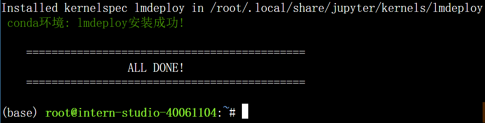
    
- 下载internlm-chat-1.8b模型
  
  Dennis作业，详见笔记2.LMDeploy模型对话(chat)：
  -  查看开发机的共享目录中准备好了常用的预训练模型：`ls /root/share/new_models/Shanghai_AI_Laboratory/`
  -  进入存放模型的目录: `cd ~`
  -  执行如下指令由开发机的共享目录软链接或拷贝模型：
    ```
    ln -s /root/share/new_models/Shanghai_AI_Laboratory/internlm2-chat-1_8b /root/
     # cp -r /root/share/new_models/Shanghai_AI_Laboratory/internlm2-chat-1_8b /root/
    ```    
  - 运行“ls”命令查看已下载的`internlm2-chat-1_8b`
  - 下载截图：
     

- 以命令行方式与模型对话
  - Dennis作业详见 笔记2.4 使用LMDeploy与模型对话：
  - 激活创建好的conda环境：`conda activate lmdeploy`
  - 执行如下命令运行下载的1.8B模型：`lmdeploy chat /root/internlm2-chat-1_8b`
  - 与模型对话截图：
     
     
     
 ### 进阶作业   
 
完成以下任务，并将实现过程记录截图：
- 设置KV Cache最大占用比例为0.4，开启W4A16量化，以命令行方式与模型对话。（优秀学员必做）
- 以API Server方式启动 lmdeploy，开启 W4A16量化，调整KV Cache的占用比例为0.4，分别使用命令行客户端与Gradio网页客户端与模型对话。（优秀学员）
- 使用W4A16量化，调整KV Cache的占用比例为0.4，使用Python代码集成的方式运行internlm2-chat-1.8b模型。（优秀学员必做）
- 使用 LMDeploy 运行视觉多模态大模型 llava gradio demo （优秀学员必做）
- 将 LMDeploy Web Demo 部署到 [OpenXLab](../tools/openxlab-deploy/) （OpenXLab cuda 12.2 的镜像还没有 ready，可先跳过，一周之后再来做）
