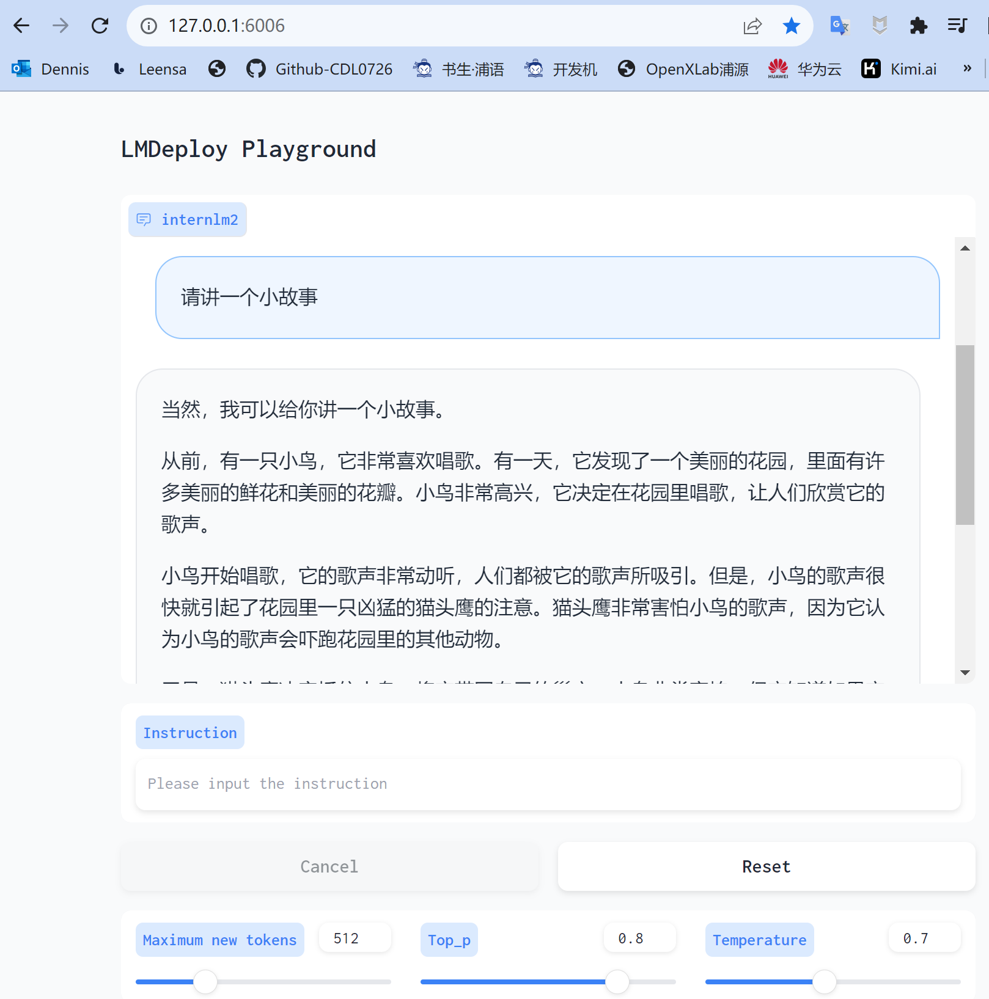

# InternLM2-Tutorial-Assignment-Lecture 4
# Lecture 4
# 第4课 LMDeploy 量化部署 LLM&VLM实战    
 2024.4.9 安泓郡  
 [LMDeploy](https://github.com/InternLM/LMDeploy)    
 [第4课 视频](https://www.bilibili.com/video/BV1tr421x75B/)    
 [第4课 文档](https://github.com/InternLM/Tutorial/blob/camp2/lmdeploy/README.md)    
 [第4课 作业](https://github.com/InternLM/Tutorial/blob/camp2/lmdeploy/homework.md)    

 ## 第4课 笔记   

### 模型部署     

- 定义：模型部署就是将训练好的深度学习模型在特定环境中运行的过程。
- 场景：
  - 服务器端：CPU部署 单GPU/TPU/NPU部署， 多卡/集卡部署
  - 移动端/边缘端：移动机器人，手机...
- 挑战：
  - 计算量巨大
  - 内存开销巨大 20B模型 40G显存
  - 访存瓶颈 大模型推理“访存密集”型任务   
  - 动态请求  请求量 时间不确定   

### 模型部署方法    

- 模型剪枝(Pruning)
- 知识蒸馏(Knowledge Distillation, KD)
- 量化(Quantization)
  


### **LMDeploy**   

- LMDeploy涵盖了LLM任务的全套轻量化、部署和服务解决方案；
- 核心功能：
    - 模型高效推理
    - 模型量化压缩
    - 服务化部署
- 性能提升
- 支持多模态
- LMDeploy支持多模型部署
  


   


### 动手实践 - 安装、部署、量化     

#### **1. LMDeploy环境部署**     

1.1 创建开发机
选择镜像`Cuda12.2-conda`；选择`10% A100*1GPU`；点击“立即创建”。   

1.2 创建conda环境
InternStudio上提供了快速创建conda环境的方法。打开命令行终端，创建一个名为`lmdeploy`的环境：   
```
studio-conda -t lmdeploy -o pytorch-2.1.2
```   

1.3 安装LMDeploy   
激活刚刚创建的虚拟环境:   
```
conda activate lmdeploy
```   

安装0.3.0版本的lmdeploy:   
```
pip install lmdeploy[all]==0.3.0
```   

#### **2. LMDeploy模型对话(chat)**    

2.1 Huggingface与TurboMind   

**HuggingFace**  

[HuggingFace](https://huggingface.co/)是一个高速发展的社区，包括Meta、Google、Microsoft、Amazon在内的超过5000家组织机构在为HuggingFace开源社区贡献代码、数据集和模型。可以认为是一个针对深度学习模型和数据集的在线托管社区，如果你有数据集或者模型想对外分享，网盘又不太方便，就不妨托管在HuggingFace。

托管在HuggingFace社区的模型通常采用HuggingFace格式存储，简写为**HF格式**。

但是HuggingFace社区的服务器在国外，国内访问不太方便。国内可以使用阿里巴巴的[MindScope](https://www.modelscope.cn/home)社区，或者上海AI Lab搭建的[OpenXLab](https://openxlab.org.cn/home)社区，上面托管的模型也通常采用**HF格式**。

**TurboMind**    

TurboMind是LMDeploy团队开发的一款关于LLM推理的高效推理引擎，它的主要功能包括：LLaMa 结构模型的支持，continuous batch 推理模式和可扩展的 KV 缓存管理器。

TurboMind推理引擎仅支持推理TurboMind格式的模型。因此，TurboMind在推理HF格式的模型时，会首先自动将HF格式模型转换为TurboMind格式的模型。**该过程在新版本的LMDeploy中是自动进行的，无需用户操作。**

几个容易迷惑的点：
* TurboMind与LMDeploy的关系：LMDeploy是涵盖了LLM 任务全套轻量化、部署和服务解决方案的集成功能包，TurboMind是LMDeploy的一个推理引擎，是一个子模块。LMDeploy也可以使用pytorch作为推理引擎。
* TurboMind与TurboMind模型的关系：TurboMind是推理引擎的名字，TurboMind模型是一种模型存储格式，TurboMind引擎只能推理TurboMind格式的模型。

2.2 下载模型 

在开发机的共享目录中准备好了常用的预训练模型，可以运行如下命令查看： 

```sh
ls /root/share/new_models/Shanghai_AI_Laboratory/
```
显示如下，每一个文件夹都对应一个预训练模型。   
   

以InternLM2-Chat-1.8B模型为例，从官方仓库下载模型。   
**InternStudio开发机上下载模型（推荐）**   

如果你是在InternStudio开发机上，可以按照如下步骤快速下载模型。

首先进入一个你想要存放模型的目录，本教程统一放置在Home目录。执行如下指令：

```sh
cd ~
```

然后执行如下指令由开发机的共享目录**软链接**或**拷贝**模型： 

```sh
ln -s /root/share/new_models/Shanghai_AI_Laboratory/internlm2-chat-1_8b /root/
# cp -r /root/share/new_models/Shanghai_AI_Laboratory/internlm2-chat-1_8b /root/
```

执行完如上指令后，可以运行“ls”命令。可以看到，当前目录下已经多了一个`internlm2-chat-1_8b`文件夹，即下载好的预训练模型。

```sh
ls
```

2.3 使用Transformer库运行模型   

Transformer库是Huggingface社区推出的用于运行HF模型的官方库。   

在2.2中，我们已经下载好了InternLM2-Chat-1.8B的HF模型。下面我们先用Transformer来直接运行InternLM2-Chat-1.8B模型，后面对比一下LMDeploy的使用感受。   

打开VSCode   

在终端中输入如下指令，新建`pipeline_transformer.py`。   
```
touch /root/pipeline_transformer.py
```

回车执行指令，可以看到侧边栏多出了pipeline_transformer.py文件，点击打开。后文中如果要创建其他新文件，也是采取类似的操作。   

内容复制粘贴进入`pipeline_transformer.py`  按`Ctrl+S`键保存   

回到终端，激活conda环境。   
```
python /root/pipeline_transformer.py
```
得到输出：   
   
**感受`Transformer`推理速度很慢，二轮对话完成用时约80秒**   

2.4 使用LMDeploy与模型对话   

如何应用LMDeploy直接与模型进行对话。

首先激活创建好的conda环境：
```
conda activate lmdeploy
```

使用LMDeploy与模型进行对话的通用命令格式为：   
```
lmdeploy chat [HF格式模型路径/TurboMind格式模型路径]
```

例如，您可以执行如下命令运行下载的1.8B模型：   
```
lmdeploy chat /root/internlm2-chat-1_8b
```
     

可以与InternLM2-Chat-1.8B大模型对话了。比如输入“请给我讲一个小故事吧”，然后按两下回车键。   
  
**速度明显比原生Transformer快**

输入“exit”并按两下回车，可以退出对话。   

**拓展内容**：有关LMDeploy的chat功能的更多参数可通过-h命令查看。
```
lmdeploy chat -h
```

#### **3. LMDeploy模型量化(lite)**   

主要介绍如何对模型进行量化。主要包括 KV8量化和W4A16量化。   

介绍 LMDeploy 量化方案前，需要先了解两个概念：

- 计算密集（compute-bound）: 指推理过程中，绝大部分时间消耗在数值计算上；针对计算密集型场景，可以通过使用更快的硬件计算单元来提升计算速。
- 访存密集（memory-bound）: 指推理过程中，绝大部分时间消耗在数据读取上；针对访存密集型场景，一般通过减少访存次数、提高计算访存比或降低访存量来优化。

常见的 LLM 模型由于 Decoder Only 架构的特性，实际推理时大多数的时间都消耗在了逐 Token 生成阶段（Decoding 阶段），是典型的访存密集型场景。   

如何优化 LLM 模型推理中的访存密集问题呢？   
- **KV8量化**
    - KV8量化是指将逐 Token（Decoding）生成过程中的上下文 K 和 V 中间结果进行 INT8 量化（计算时再反量化），以降低生成过程中的显存占用。
- **W4A16量化**
    - 将 FP16 的模型权重量化为 INT4，Kernel 计算时，访存量直接降为 FP16 模型的 1/4，大幅降低了访存成本。Weight Only 是指仅量化权重，数值计算依然采用 FP16（需要将 INT4 权重反量化）。
 
**3.1 设置最大KV Cache缓存大小** 
 KV Cache是一种缓存技术，通过存储键值对的形式来复用计算结果，以达到提高性能和降低内存消耗的目的。在大规模训练和推理中，KV Cache可以显著减少重复计算量，从而提升模型的推理速度。   
理想情况下，KV Cache全部存储于显存，以加快访存速度。当显存空间不足时，也可以将KV Cache放在内存，通过缓存管理器控制将当前需要使用的数据放入显存。   

模型在运行时，占用的显存可大致分为三部分：模型参数本身占用的显存、KV Cache占用的显存，以及中间运算结果占用的显存。   
LMDeploy的KV Cache管理器可以通过设置`--cache-max-entry-count`参数，控制KV缓存**占用剩余显存**的最大比例。默认的比例为0.8。   

下面通过几个例子，来看一下调整--cache-max-entry-count参数的效果。首先保持不加该参数（默认0.8），运行1.8B模型。   
```
lmdeploy chat /root/internlm2-chat-1_8b
```

与模型对话，查看右上角资源监视器中的显存占用情况。   

   

此时显存占用为7856MB。下面，改变`--cache-max-entry-count`参数，设为0.5。   
```
lmdeploy chat /root/internlm2-chat-1_8b --cache-max-entry-count 0.5
```

与模型对话，再次查看右上角资源监视器中的显存占用情况。   

   

看到显存占用明显降低，变为6608M。   

下面来一波“极限”，把`--cache-max-entry-count`参数设置为0.01，约等于禁止KV Cache占用显存。   

```
lmdeploy chat /root/internlm2-chat-1_8b --cache-max-entry-count 0.01
```

    

然后与模型对话，可以看到，此时显存占用仅为4560MB，代价是会降低模型推理速度。   


**3.2 使用W4A16量化**   

LMDeploy使用AWQ算法，实现模型4bit权重量化。推理引擎TurboMind提供了非常高效的4bit推理cuda kernel，性能是FP16的2.4倍以上。它支持以下NVIDIA显卡：   
- 图灵架构（sm75）：20系列、T4
- 安培架构（sm80,sm86）：30系列、A10、A16、A30、A100
- Ada Lovelace架构（sm90）：40 系列

 运行前，首先安装一个依赖库。   
 ```
pip install einops==0.7.0
```

仅需执行一条命令，就可以完成模型量化工作。   
```
lmdeploy lite auto_awq \
   /root/internlm2-chat-1_8b \
  --calib-dataset 'ptb' \
  --calib-samples 128 \
  --calib-seqlen 1024 \
  --w-bits 4 \
  --w-group-size 128 \
  --work-dir /root/internlm2-chat-1_8b-4bit
```

运行时间较长，请耐心等待。
**量化工作结束后，新的HF模型被保存到`internlm2-chat-1_8b-4bit`目录。**

运行`ls` 可以查看已经量化好的模型`internlm2-chat-1_8b-4bi`   

  

下面使用Chat功能运行W4A16量化后的模型。   
```
lmdeploy chat /root/internlm2-chat-1_8b-4bit --model-format awq
```
为了更加明显体会到W4A16的作用，我们将KV Cache比例再次调为0.01，查看显存占用情况。   
```
lmdeploy chat /root/internlm2-chat-1_8b-4bit --model-format awq --cache-max-entry-count 0.01
```

可以看到，显存占用变为2472MB，明显降低。  
    

**拓展内容**：有关LMDeploy的lite功能的更多参数可通过-h命令查看。
```
 lmdeploy lite -h
```

#### **4. LMDeploy服务(serve)**   

在第二章和第三章，我们都是在本地直接推理大模型，这种方式成为本地部署。   
在生产环境下，我们有时会将大模型封装为API接口服务，供客户端访问。

 看下面一张架构图：   

    

 我们把从架构上把整个服务流程分成下面几个模块。   

 - **Model Inference/Server** 模型推理/服务。主要提供模型本身的推理，一般来说可以和具体业务解耦，专注模型推理本身性能的优化。可以以模块、API等多种方式提供。
 - **API Server**。中间协议层，把后端推理/服务通过HTTP，gRPC或其他形式的接口，供前端调用。
 - **Client**。可以理解为前端，与用户交互的地方。通过通过网页端/命令行去调用API接口，获取模型推理/服务。

以上的划分是一个相对完整的模型，但在实际中这并不是绝对的。比如可以把“模型推理”和“API Server”合并，有的甚至是三个流程打包在一起提供服务。    

**4.1 启动API服务器**

通过以下命令启动API服务器，推理`internlm2-chat-1_8b`模型：   
```
lmdeploy serve api_server \
    /root/internlm2-chat-1_8b \
    --model-format hf \
    --quant-policy 0 \
    --server-name 0.0.0.0 \
    --server-port 23333 \
    --tp 1
```

其中，model-format、quant-policy这些参数是与第三章中量化推理模型一致的；server-name和server-port表示API服务器的服务IP与服务端口；tp参数表示并行数量（GPU数量）。

通过运行以上指令，我们成功启动了API服务器，请勿关闭该窗口，后面我们要新建客户端连接该服务。

模型运行的窗口如下：   
    

可以通过运行一下指令，查看更多参数及使用方法：    
```
lmdeploy serve api_server -h
```
用`Win+R` 打开Windows 的 PowerShell， 输入下列命令：
```
ssh -CNg -L 23333:127.0.0.1:23333 root@ssh.intern-ai.org.cn -p 42978
```

ssh 端口号就是下面图片里的 42978，请替换为你自己的。   

可以直接打开http://{host}:23333查看接口的具体使用说明，如下图所示:    

  

**4.2 命令行客户端连接API服务器**   

在“4.1”中，我们在终端里新开了一个API服务器。    

本节中，我们要新建一个命令行客户端去连接API服务器。首先通过VS Code新建一个终端：   

     

激活conda环境。    
```
conda activate lmdeploy
```

    

运行命令行客户端：    
```
lmdeploy serve api_client http://localhost:23333
```

运行后，可以通过命令行窗口直接与模型对话：   

   

现在使用的架构是这样的：   

     

**4.3 网页客户端连接API服务器**  

关闭刚刚的VSCode终端，但服务器端的终端不要关闭。

新建一个VSCode终端，激活conda环境: `conda activate lmdeploy`   

使用Gradio作为前端，启动网页客户端。   
```
lmdeploy serve gradio http://localhost:23333 \
    --server-name 0.0.0.0 \
    --server-port 6006
```

    

运行命令后，网页客户端启动。在windows电脑本地新建一个powershell终端，新开一个转发端口：   
```
ssh -CNg -L 6006:127.0.0.1:6006 root@ssh.intern-ai.org.cn -p 42978
```

打开浏览器，访问地址`http://127.0.0.1:6006`   

然后就可以与模型进行对话了！

     

现在使用的架构是这样的：   

 


**5.Python代码集成**   

在开发项目时，有时我们需要将大模型推理集成到Python代码里面。   

5.1 Python代码集成运行1.8B模型   

首先激活conda环境: `conda activate lmdeploy`   

新建Python源代码文件pipeline.py。   
```
touch /root/pipeline.py
```

打开pipeline.py，填入以下内容。    
```
from lmdeploy import pipeline

pipe = pipeline('/root/internlm2-chat-1_8b')
response = pipe(['Hi, pls intro yourself', '上海是'])
print(response)
```

**代码解读**：\   
- 第1行，引入lmdeploy的pipeline模块 \
- 第3行，从目录“./internlm2-chat-1_8b”加载HF模型 \
- 第4行，运行pipeline，这里采用了批处理的方式，用一个列表包含两个输入，lmdeploy同时推理两个输入，产生两个输出结果，结果返回给response \
- 第5行，输出response
 
保存后运行代码文件：   
```
python /root/pipeline.py
```
     

5.2 向TurboMind后端传递参数    

在第3章，我们通过向lmdeploy传递附加参数，实现模型的量化推理，及设置KV Cache最大占用比例。在Python代码中，可以通过创建TurbomindEngineConfig，向lmdeploy传递参数。   

以设置KV Cache占用比例为例，新建python文件    
`pipeline_kv.py`。    

打开`pipeline_kv.py`，填入如下内容：   
```
from lmdeploy import pipeline, TurbomindEngineConfig

# 调低 k/v cache内存占比调整为总显存的 20%
backend_config = TurbomindEngineConfig(cache_max_entry_count=0.2)

pipe = pipeline('/root/internlm2-chat-1_8b',
                backend_config=backend_config)
response = pipe(['Hi, pls intro yourself', '上海是'])
print(response)
```

保存后运行python代码：    
```
python /root/pipeline_kv.py
```

得到输出结果：   

  


 ## 第4课 作业     

### 基础作业（结营必做）
完成以下任务，并将实现过程记录截图：    

- 配置lmdeploy运行环境
  
  Dennis作业，详见笔记1.LMDeploy环境部署：
  - 创建开发机：选择镜像`Cuda12.2-conda` 选择`10% A100*1GPU`
  - 创建`conda`环境： `studio-conda -t lmdeploy -o pytorch-2.1.2`
  - 激活刚创建的虚拟环境： `conda activate lmdeploy`
  - 安装0.3.0版本的lmdeploy：`pip install lmdeploy[all]==0.3.0`
    
    
- 下载internlm-chat-1.8b模型
  
  Dennis作业，详见笔记2.LMDeploy模型对话(chat)：
  -  查看开发机的共享目录中准备好了常用的预训练模型：`ls /root/share/new_models/Shanghai_AI_Laboratory/`
  -  进入存放模型的目录: `cd ~`
  -  执行如下指令由开发机的共享目录软链接或拷贝模型：
    ```
    ln -s /root/share/new_models/Shanghai_AI_Laboratory/internlm2-chat-1_8b /root/
     # cp -r /root/share/new_models/Shanghai_AI_Laboratory/internlm2-chat-1_8b /root/
    ```    
  - 运行“ls”命令查看已下载的`internlm2-chat-1_8b`
  - 下载截图：
     

- 以命令行方式与模型对话
  Dennis作业详见 笔记2.4 使用LMDeploy与模型对话：
  - 激活创建好的conda环境：`conda activate lmdeploy`
  - 执行如下命令运行下载的1.8B模型：`lmdeploy chat /root/internlm2-chat-1_8b`
  - 与模型对话截图：
     
     
     
 ### 进阶作业   
 
完成以下任务，并将实现过程记录截图：

- 设置KV Cache最大占用比例为0.4，开启W4A16量化，以命令行方式与模型对话。（优秀学员必做）

  在基础作业的基础之上， 下面改变`--cache-max-entry-count`参数，设为0.4.   

```
lmdeploy chat /root/internlm2-chat-1_8b --cache-max-entry-count 0.4

```
    
 
 
 
  此时显存占用为6192MB.

  开启W4A16量化，首先安装一个依赖库：
```
pip install einops==0.7.0
```

  执行下列一条命令，完成模型的量化工作：    
```
lmdeploy lite auto_awq \
   /root/internlm2-chat-1_8b \
  --calib-dataset 'ptb' \
  --calib-samples 128 \
  --calib-seqlen 1024 \
  --w-bits 4 \
  --w-group-size 128 \
  --work-dir /root/internlm2-chat-1_8b-4bit
```

使用Chat功能运行W4A16量化后的模型, 将KV Cache比例调为0.4；   
```
lmdeploy chat /root/internlm2-chat-1_8b-4bit --model-format awq --cache-max-entry-count 0.4
```

以命令行方式与模型对话截图如下： 

   
    

- 以API Server方式启动 lmdeploy，开启 W4A16量化，调整KV Cache的占用比例为0.4，分别使用命令行客户端与Gradio网页客户端与模型对话。（优秀学员）

通过以下命令启动API服务器，推理`internlm2-chat-1_8b-4bit`模型：

```
lmdeploy serve api_server \
    /root/internlm2-chat-1_8b-4bit \
    --model-format awq \
    --quant-policy 0 \
    --server-name 0.0.0.0 \
    --server-port 23333 \
    --tp 1
```

**用命令行客户端与模型对话**

在上面，我们在终端里新开了一个API服务器。    

我们要新建一个命令行客户端去连接API服务器。
首先通过VS Code新建一个终端，   
然后激活conda环境`conda activate lmdeploy`
运行命令行客户端：    
```
lmdeploy serve api_client http://localhost:23333
```

运行后，可以通过命令行窗口直接与模型对话：    

   

**用Gradio网页客户端与模型对话**    

关闭刚刚的VSCode终端，但服务器端的终端不要关闭。   
新建一个VSCode终端，激活conda环境 `conda activate lmdeploy`。   
使用Gradio作为前端，启动网页客户端。   
```
lmdeploy serve gradio http://localhost:23333 \
    --server-name 0.0.0.0 \
    --server-port 6006
```

    

运行命令后，网页客户端启动。在windows电脑本地新建一个powershell终端，新开一个转发端口：   
```
ssh -CNg -L 6006:127.0.0.1:6006 root@ssh.intern-ai.org.cn -p 42978  
```

打开浏览器，访问地址`http://0.0.0.0:6006`

  

然后就可以与模型进行对话:

    


- 使用W4A16量化，调整KV Cache的占用比例为0.4，使用Python代码集成的方式运行internlm2-chat-1.8b模型。（优秀学员必做）


- 使用 LMDeploy 运行视觉多模态大模型 llava gradio demo （优秀学员必做）


- 将 LMDeploy Web Demo 部署到 [OpenXLab](../tools/openxlab-deploy/) （OpenXLab cuda 12.2 的镜像还没有 ready，可先跳过，一周之后再来做）
